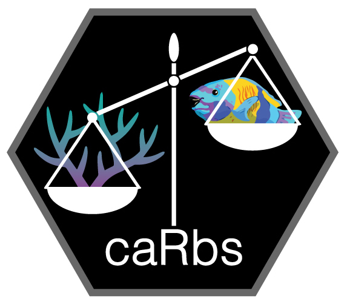

```{r, include = FALSE}
knitr::opts_chunk$set(
  collapse = TRUE,
  comment = "#>",
  fig.path = "man/figures/README-",
  out.width = "100%"
)
```

# Welcome

<!-- badges: start -->
<!-- badges: end -->



**This package is under active development.**

`caRbs` is an R package designed to compute carbonate budgets for sites across the Great Barrier Reef (GBR) from standard field survey and monitoring data. Carbonate budgets can be used as powerful indicators of reef state but have previously relied on specialized and time-intensive data collection protocols that have precluded their application in many locations. `caRbs` offers an accessible alternative with specialized parameterisation for GBR-specific species and ecological conditions. 

This package estimates the balance between growth of calcifying organisms, corals (`pproduction`) and algae (`sproduction`), and the counteractive bioerosion of fishes (`perosion`) and boring organisms (`serosion`) using census-based benthic cover and fish abundance data. Ecological processes, including 3-dimensional growth, boring, and fish grazing, are simulated across a yearly time-step to quantify total change in calcium carbonate (CaCO3) for a given site. Monte Carlo simulations are used to account for parameter uncertainty and generate probabilistic outcomes that offer nuance to the interpretation of final budget estimates (`cbudget`).

## Installation

`caRbs` is not yet available on CRAN. You can install the development version using `devtools` like so:

``` r
install.packages("devtools")
devtools::install_github("aadesbiens/caRbs")
```

## Usage
For a quick test drive, try out the following code using the `sproduction` function as an example:

```r
library(caRbs) # load package

# Create dummy dataset
alg <- c("Halimeda", "CCA") # list of the detected species
cov <- c(5.4, 8.2) # corresponding % cover of each species type

# Calculate carbonate production
## naming conventions for each field described in accompanying help files

x <- sproduction(
species = alg, # character vector of all detected species
cover = cov, # numeric vector of % cover for each species
rug = 2, # visual estimate of rugosity of the site (1 - 5 ordinal scale)
region = "north", # site region
shelf = "O") # site shelf position

# Inspect results
summary(x) # view mean and standard error estimates
plot(x) # visualise distribution of estimates
```
For a more comprehensive run-down of the build process and usage cases see `vignettes("caRbs")`.

## Feedback and Contributions
`caRbs` is under continuous development. If you find any bugs or have feedback, contact us by [opening an issue](https://github.com/aadesbiens/caRbs/issues). For more complex issues and/or discussion feel free to contact me via [email](mailto:a.desbiens@uq.net.au). If you would like to contribute to future iterations of `caRbs`, be it with data or code, please don't hesitate to reach out!

## Collaborators
The first iteration of `caRbs` was developed under the umbrella of the Australian Government's National Environmental Science Program ([NESP 6.5](https://nesptropical.edu.au/index.php/round-6-projects/project-6-5/)).

Package development and maintenance facilitated by:

* **Amelia Desbiens** - University of Queensland
* **George Roff** - University of Queensland
* **Kennedy Wolfe** - University of Queensland
* **Peter J. Mumby** - University of Queensland

With continued data provisioning and feedback from:

* **Matthew P. Adams** - Queensland University of Technology
* **Mark Baird** - CSIRO Oceans & Atmosphere
* **Milani Chaloupka** - University of Queensland
* **Guillermo Diaz-Pulido** - Griffith University
* **Michael J. Emslie** - Australian Institute of Marine Science
* **Andrew Hoey** - James Cook University
* **Emma Kennedy** - Australian Institute of Marine Science
* **Mathieu Mongin** - CSIRO Oceans & Atmosphere
* **Angus Thompson** - Australian Institute of Marine Science
* **Tries B. Razak** - University of Padjadjaran
